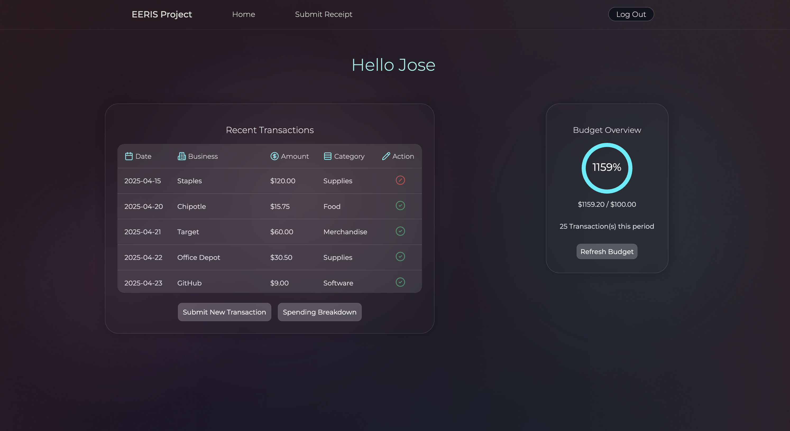
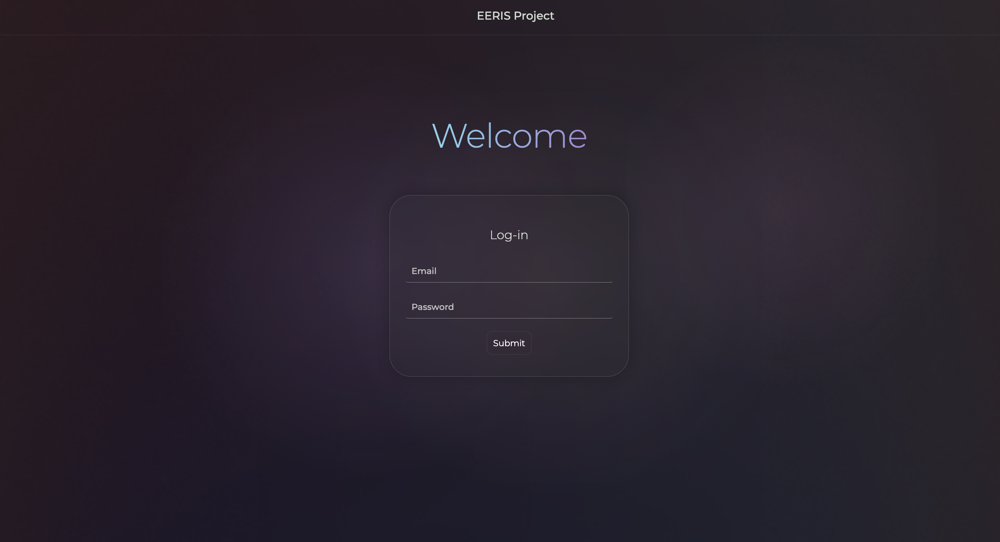
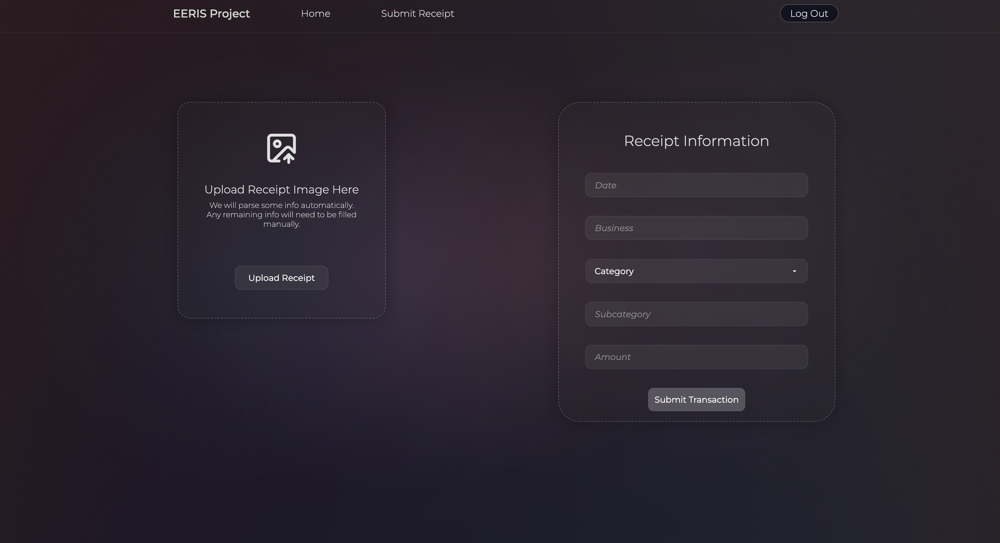
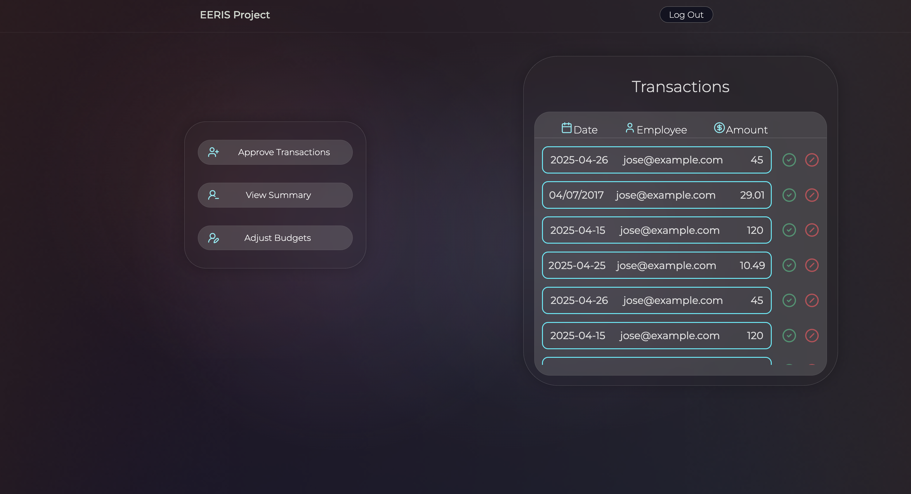
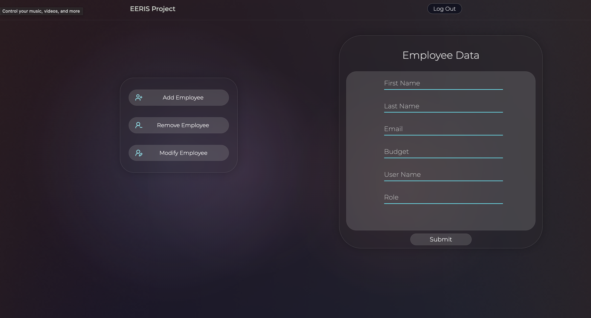
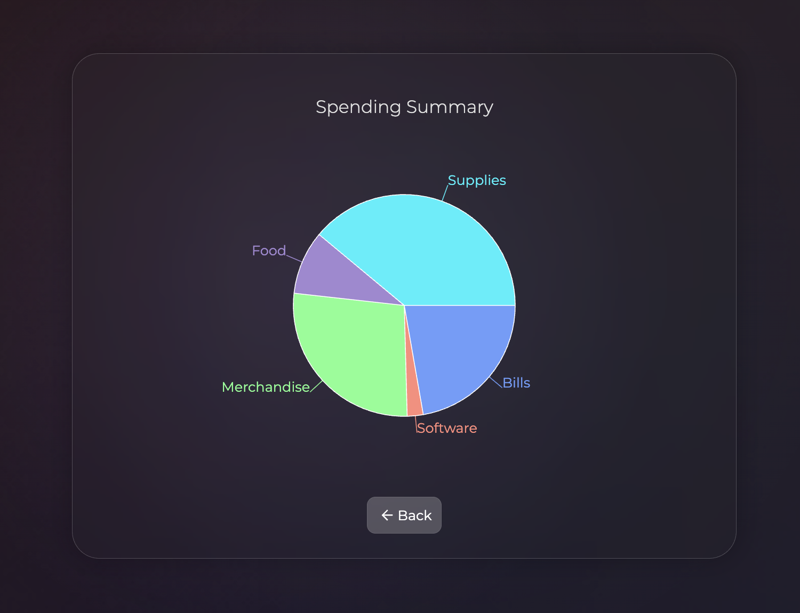

# 💼 EERIS – Employee Expense Reporting and Information System

EERIS is a full-stack web application that helps organizations streamline employee expense reporting, automate receipt parsing, and manage real-time budgets through secure, role-based dashboards for Employees, Managers, and HR.



---

## ⚙️ Tech Stack

| Frontend | Backend | Database | AI & Auth |
|----------|---------|----------|-----------|
| React.js | FastAPI (Python) | MongoDB | OpenAI API, JWT Auth |

---

## 🧩 Features

- 🔐 **Login Page** — Secure user authentication
- 🧾 **Add New Expense** — Upload receipts and add expenses
- 📊 **Budget Summary** — Track budget usage visually
- 🧍‍♂️ **Employee Dashboard** — View receipts and budget info
- ✔️ **Manager Approval** — Approve or reject transactions
- 🧑‍💼 **HR Tools** — Add/modify employee records
- 🧮 **Spending Distribution Chart** — Pie chart of categorized expenses
- 📷 **AI Receipt Parsing** — Extracts data from uploaded images

---

## 🖥️ UI Screens

> Make sure to store all screenshots inside the `assets/` folder and update paths as needed.

| Login | Add Expense | Dashboard |
|:--:|:--:|:--:|
|  |  |  |

| Budget Summary | Manager Approval | HR Panel |
|:--:|:--:|:--:|
|  |  |  |

| Spending Chart |
|:--:|
|  |

---

## 🚀 How to Run the Project

### 🔁 Backend Setup (FastAPI)

```bash
cd routes
python3 -m venv venv
source venv/bin/activate
pip install -r requirements.txt
python testData.py   # Load test data
uvicorn main:app --reload
````

### Frontend Setup (React)
```bash
Copy
Edit
cd ../FrontEnd/eerisfront
npm install
npm start
````
